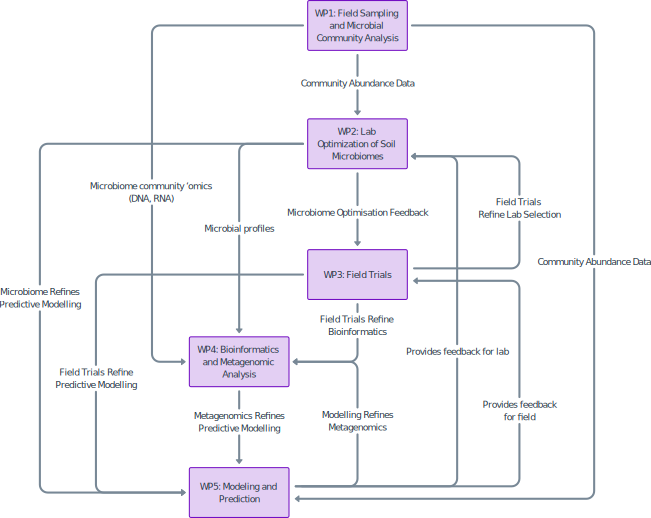

# The Microbiome Green Revolution's documentation for working with data and metadata

## Table of Contents
* [FAIR Principles](#fair-principles)
* [Data Principles](#data-principles)
* [Metadata Principles](#metadata-principles)
* [Working within this repository](#working-within-this-repository)
* [Git for Collaboration](#git-for-collaboration)

---

### FAIR Principles
This documentation standardises the formatting of data files and sample metadata to comply with reproducible and communicable industry standards. The FAIR principles—Findability, Accessibility, Interoperability, and Reusability—apply directly to data naming conventions of the Microbiome Green Revolution project, ensuring our datasets are well-organised, understandable, and universally usable. Below is an outline of how FAIR principles guide effective data naming practices:
1. Findable
   - **Descriptive Names:** Data files and variables should have meaningful, descriptive names that clearly indicate their content or purpose. For example, names should include project identifiers, experiment types, or dates where relevant.
   - **Consistent Formatting:** Use consistent naming conventions across all files and datasets to make them easier to locate in large repositories. For instance, always use the same date format (e.g., YYYY-MM-DD) or structure (e.g., Project_Condition_Date).
   - **Unique Identifiers:** Ensure each dataset or file name is unique within the context of the project or repository, avoiding duplication or ambiguity.

2. Accessible
    - **Human-Readable Names:** Names should be easy to interpret by both humans and machines, avoiding overly cryptic codes or excessive abbreviations.
    - **No Special Characters:** Avoid spaces, special characters, or symbols in names that might interfere with software or database queries. Instead, use underscores (_) or hyphens (-) to separate words.
    - **Logical Organisation:** Files should be systematically named and stored to allow straightforward navigation, supporting accessibility within and across systems.

3. Interoperable
    - **Standardised Conventions:** Adopt widely accepted naming conventions that are compatible with various software, systems, and disciplines. For instance, follow established formats like snake_case or camelCase.
    - **Versioning:** Use version control to maintain and clarify relationships between iterations.
    - **Avoid Context Dependency:** Names should stand alone without requiring external context to interpret their meaning, ensuring compatibility across systems and teams.

4. Reusable
    - **Clear Metadata Alignment:** Ensure naming conventions align with metadata descriptions, enabling future users to understand the data’s structure and content without additional clarification.
    - **Temporal and Contextual Consistency:** Data names should be timeless, avoiding transient references (e.g., "latest" or "temp") that lose meaning over time.
    - **Scalable Conventions:** Use naming patterns that can scale as the dataset grows, accommodating new files or variables without disrupting the established system.

---

### Data Principles

**The person responsible for formatting the data and metadata in an appropriately reproducible manner is the one collecting it.** Fundamentally, they are the best to explain the biological meaningfulness of their data and produce understandable documentation. The GitHub LFS repository for storing the Microbiome Green Revolution's raw data can be found here **<link to data repository once it's set up>**.

Raw data consists of the direct outputs of a field observation or a laboratory instrument. It includes: 
- Quantitative data recorded in a laboratory notebook (e.g. a series of plant heights), transcribed into a spreadsheet or photographed 
- Raw sequence files (e.g., in fastq format) 
- Data exported directly from an instrument (e.g. microplate spectrophotometer, real-time PCR machine) into a universal format (e.g. a .csv file) 
- Data exported directly from an instrument in native file format (e.g. a .ghg file from a LI-COR) 
- Raw image files (e.g. in .jpeg or .png format) 

Data file formatting principles for a multidisciplinary research project should ensure clarity, consistency, and usability across all datasets. The following guidelines should be followed:

1. **File Naming and Metadata:** Each file should have a clear and consistent name that reflects its content and purpose, such as including experiment identifiers or batch numbers (e.g., ```dna_quantifications.csv``` or ```sequencing_qc.csv```). Every dataset should include accompanying metadata that explains the purpose of the file, the meaning of each column, and the format and units of the data. For instance, numerical values such as DNA quantities should clearly specify units (e.g., ```μg/μl```), and dates should follow the consistent format ```dd/mm/yyyy```.

2. **Column Names and Data Description:** Column names should be consistent across all files, using a clear convention like ```snake_case```. For example, columns like plate, well, and sample should have consistent formatting and align with the descriptions provided in the metadata. These descriptions should be detailed, explaining any specific rules or conventions (e.g., plate numbers formatted as ```p1```, ```p2```, etc., and sample IDs that reflect collection details, such as ```7PY.01.18```).

3. **Data Consistency and Standardisation:** All data entries should follow a standard format for each variable. For example, well positions should use an alphanumeric grid system like ```A1``` or ```B12```, and sample IDs should follow a predefined naming convention that reflects the collection method or source. Numeric fields should adhere to defined ranges or thresholds, while categorical variables (e.g., levels of inoculum or nitrogen treatments) must use consistent, pre-established labels.
   - **The data within columns should not contain values that could be treated as delimiters, such as commas, spaces, tabs, etc.** 
   - **If there are multiple data points within a single cell, it is always best to split the values into a new column to maintain a consistent format that does not require editing to be interpreted and analysed.**  

4. **Handling Missing Data:** Missing or unused data should be clearly marked using standardised values such as "EMPTY" for wells that are intentionally left unused or "NA" for unavailable data. This ensures missing data can be easily identified and managed in subsequent analyses.

5. **Data Structure for Analysis:** Files should be structured to facilitate integration into downstream processes, such as statistical analyses or modelling. Each row should correspond to an individual observation (e.g., wells, plants, or samples), and each column should represent a single variable. A tidy data structure should be maintained, where every variable has a dedicated column and every observation occupies a single row.

   | Category         | Principle                     | Good Example                             | Bad Example                        |
   |------------------|-------------------------------|------------------------------------------|------------------------------------| 
   | Column Names     | Consistent formatting         | ```sample_id```, ```plant_weight```      | ```SampleID```, ```Plant Weight``` |
   |                  | Descriptive and clear         | ```well_position```, ```dna_quantity```  | ```wp```, ```quantity```           |
   |                  | Standardised convention       | ```snake_case``` (e.g., ```sample_id```) | ```SAMPLEID```, ```sample.id```    |
   |                  | No special characters         | ```plate_number```                       | ```plate#```                       |
   | Data Conventions | Standardised units            | ```μg/μl```, ```g```                     | No units or mixed units            |
   |                  | Uniform date formats          | ```dd/mm/yyyy```                         | mm/dd/yyyy, 2024-Nov-25            |
   |                  | Clear missing data markers    | ```EMPTY```, ```NA```                    | Blank cells, ```0```               |
   |                  | Predefined categorical labels | ```N```, ```Y``` for nitrogen use        | ```Yes```, ```No```, ```N2```      |
   |                  | Data values                   |                                          |                                    | 

<br>

---

### Metadata Principles
The metadata file is integral to our data management plan. It should be possible for an unaffiliated researcher, years in the future, to reconstruct the entire data collection process given the metadata file and its associated raw data file(s). 

A metadata markdown file in this repository should contain a description that has, at a minimum: 
- Enough information to identify the specific experiment from which the data was collected, including date(s) of collection and the identity of the experimenter, and a brief description of the experimental design (e.g. ‘soil microbiome sequence data collected from 100 farms across the UK between April and June 2025;’ ‘MSc project to examine disease severity in wheat inoculated with different strains of G. tritici’)
  - Do not include an experiment description which would be uninterpretable by an unaffiliated researcher (e.g. ‘samples from second passage;’ ‘Amy’s MSc project’)  
- Specific GPS location of the experiment (for field-based experiments/samples)  
- The type of data being collected (e.g. sequence data, index of plant infection level, etc.)   
- Any unique identifiers for the specific output data that will be useful in understanding where it has originated from.

Within the same file, there should be a summary table describing the structure of the raw data set. In this table, the columns of the raw data become rows, with a minimum of a column descriptor, explaining what the data in the column is, and a data descriptor, explaining what format the data within the column is in:

#### Raw Data Table
| Column 1 | Column 2 | Column 3 |
|----------|----------|----------|
| a        | 1        | a1       |

#### Metadata Table
| Columns         | Column Description                                                            | Data Description                                                                                                                                   | 
|-----------------|-------------------------------------------------------------------------------|----------------------------------------------------------------------------------------------------------------------------------------------------|
| Column&nbsp;1   | Column containing alphabetic data                                             | Data contains any of the 26 Latin letters in lower case, between A-Z                                                                               |
| Column&nbsp;2   | Column containing numeric data                                                | Data contains integers                                                                                                                             |
| Column&nbsp;3   | Column containing alphanumeric data as a combination of Column 1 and Column 2 | Data is alphanumeric combination of the 26 Latin letters in lower case, and integers, in the form of "xy" where x is the letter and y the integer. |

---

### Working within this repository

A mind map of the data flow between work packages can be seen below. It is imperative to maintain well documented and easily accessible data and metadata that can flow between the work packages. This can be achieved using version controlled documentation that is updated regularly.

 

Data descriptor files should be placed within the relevant work package directory. For each data file in the data repository **<link to data repository once it's set up>** there must be a metadata or data descriptor file in this repository. The structure of the data sets within the WP directories should reflect the data directories, meaning if single analyses produce relevant, grouped data sets, then these should be placed into subdirectories in the data repository with their corresponding metadata file in this repository.   

- **Within each workpackage directory, please include a ```README.md``` file that outlines the directory structure and purpose of the data.**
- **
- **If you enter a data file into the data repository, and don't include a corresponding descriptor/metadata file here, please know that no one will understand what it is for.** 


For example, and acceptable directory in the data repository could be:
```
WP1
|-- README.md
|-- field_data/
|-- |-- field_site_information.csv
|-- dna_quantification/
|-- |-- dna_quantification_results.csv
|-- |-- dna_quantification_parameters.csv
```
An appropriate metadata repository would include descriptor files in the following directories in this repository:
```
WP1
|-- README.md
|-- field_data/
|-- |-- field_site_information.md
|-- dna_quantification/
|-- |-- dna_quantification_results.md
|-- |-- dna_quantification_parameters.md
```

---

### Git for collaboration
There are 3 methods to interact with this repository using Git. Firstly, you can directly upload files and edit readme documents using the GitHub website. Second, you can download the GitHub Desktop application on Windows and Mac. Third, using Git on your local machine in terminal by cloning the repository. The process for achieving this can be seen below:


#### First, clone the repository to your local system:
This will create a local copy of the most up-to-date GitHub directory in your system, and will establish a connection between you and the remote repository.
```
cd <desired-directory> # Switch to an appropriate directory

git clone git@github.com:Microbiome-Revolution/Data-standard.git
cd Data-standard # Change to the repo directory
```

#### Before making changes:
Before starting new work or resolving conflicts, pull the latest changes. This will make your local version the same as the remote repository on GitHub. You should do this every time before you make changes to the directory on your local system, as in a large collaborative project your local copy will be behind the main branch frequently.
```
git fetch origin
git merge origin/main
```

#### Create a new branch:
This switches to a unique branch of the main repository that ensures changes are tracked and isolated to your unique stream. The changes will be merged into the main branch (```main```) at a later point when you are sure the changes should be made to the main repository. **Make sure that the most up-to-date remote repository is the one you actually want to be working on, though, as this is what you will be updating your local copy to.**
```
# Create and switch to a new branch
git checkout -b <branch-name>
```

#### Check the repository status:
This will tell you which files you have modified, added or deleted since retrieving the latest version of the repository. 
```
git status
```

#### Modify your data files and commit changes: 
You can now update the ```README.md``` files and include any graphics or metadata files that you want to include on the remote repository. Make sure that these files adhere to the principles above, and fully work as intended with no errors. You can then add the files, and commit them with an informative message of the change: 
```
# Stage your changes
git add <file-paths>

# Commit with a meaningful message
git commit -m "Added metadata for WP<X>: <description>"
```

#### Push and Pull Request
You can then push these changes to the branch of the remote repository. This then requires merging in the remote repository that is enabled through a "pull request". After pushing to your branch, submit a pull request and tag specific individuals in the MGR team that can review your request and merge the changes. This adds a layer of redundancy and checks that prevent conflicts and accidental information loss.
```
git push origin <branch-name>
```

