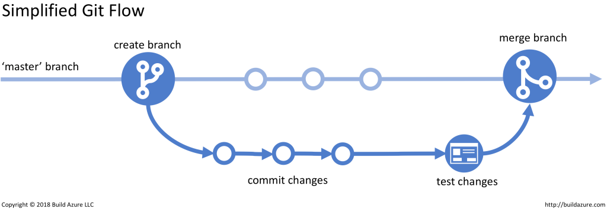

# The Microbiome Green Revolution's data storage and documentation repository

### The purpose of this repository is to store data that is created using the protocols detailed in the projects [Sample Protocol repository](https://github.com/Microbiome-Revolution/SampleProtocols). This repository should *not* be used for storing data that is irrelevant to the study aims, accessory to main files that are essential to the project and its analyses, or inaccessible data. 

### Before contributing to this repository, please familiarise yourself with the data and metadata principles below for how to structure your files appropriately, including all necessary information outlined in the protocols. 

### This repository is set up using GitHub LFS to store the Microbiome Green Revolution's data and associated metadata, with a primary goal being to keep well documented and compact data, avoiding redundant and duplicated files, using version control.  


# Table of Contents
* [Data Principles](#data-principles)
* [Metadata Principles](#metadata-principles)
* [Directory Structure](#directory-structure)
* [Git Workflow](#git-workflow)

---

### Briefing

Please follow this decision tree to determine whether the data you are trying to include in this repository is appropriate.

 

---

### Data Principles

**The person responsible for formatting the data and metadata in an appropriately reproducible manner is the one collecting it.** Fundamentally, they are the best to explain the biological meaningfulness of their data and methods, and produce understandable documentation. 

Data consists of the outputs of a field observation or a laboratory instrument formatted into a accessible file rather than direct outputs. This is primarily because of the nature of the project requiring a large amount of data to be spread across an interdisciplinary team, requiring immediate access to usable data. It includes: 
- Quantitative data recorded in a laboratory notebook (e.g. a series of plant heights), transcribed into a spreadsheet 
- Data exported directly from an instrument (e.g. microplate spectrophotometer, real-time PCR machine) into a universal format (e.g. a .csv file) and organised appropriately into a single file
- Raw image files (e.g. in .jpeg or .png format) 
- Raw sequence files (e.g., in fastq format) should **not be included in this repository**

Data file formatting principles for this project should ensure clarity, consistency, and usability across all datasets. The following guidelines should be followed:

- Each file should have a clear and consistent name that reflects its content and purpose. For example, dna quantifications of falmer kit samples should be named ```falmer_kit_dna_quantifications.csv```, to allow additions to be made to the file without naming changes. 
  - Master's student data files should be named as: ```<firstname>_<surname>_<msc/mres>_<year>_<naming structure as above>.csv```
<br> <br>
- Every dataset should include an accompanying metadata markdown file that explains the purpose of the file, named with the same prefix as the file it describes, e.g. the above file's metadata would be named ```falmer_kits_dna_quantifications.md```
<br> <br>
- Columns should have consistent formatting and align with the descriptions provided in the metadata. These descriptions should be detailed, explaining any specific rules or conventions (e.g., plate numbers formatted as ```p1```, ```p2```, etc., and sample IDs that reflect collection details, such as ```7PY.01.18```).
<br> <br>
- All data entries should follow a standard format for each variable. For example, well positions should use an alphanumeric grid system like ```A1``` or ```B12```, and sample IDs should follow a predefined naming convention. that reflects the collection method or source. Numeric fields should adhere to defined ranges or thresholds, while categorical variables (e.g., levels of inoculum or nitrogen treatments) must use consistent, pre-established labels.
   - **The data within columns should not contain values that could be treated as delimiters, such as commas, spaces, tabs, etc.** 
   - **If there are multiple data points within a single cell, it is always best to split the values into a new column to maintain a consistent format that does not require editing to be interpreted and analysed.**  
<br>
- Missing or unused data should be clearly marked using standardised values such as "EMPTY" for values that are intentionally left unused or "NA" for unavailable data. This ensures missing data can be easily identified and managed in subsequent analyses.
<br> <br>
- Files should be structured to facilitate integration into downstream processes, such as statistical analyses or modelling. Each row should correspond to an individual observation (e.g., wells, plants, or samples), and each column should represent a single variable. Every variable has a dedicated column and every observation occupies a single row.


   | Category         | Principle                     | Good Example                             | Bad Example                        |
   |------------------|-------------------------------|------------------------------------------|------------------------------------| 
   | Column Names     | Consistent formatting         | ```sample_id```, ```plant_weight```      | ```SampleID```, ```Plant Weight``` |
   |                  | Descriptive and clear         | ```well_position```, ```dna_quantity```  | ```wp```, ```quantity```           |
   |                  | Standardised convention       | ```snake_case``` (e.g., ```sample_id```) | ```SAMPLEID```, ```sample.id```    |
   |                  | No special characters         | ```plate_number```                       | ```plate#```                       |
   | Data Conventions | Standardised units            | ```μg/μl```, ```g```                     | No units or mixed units            |
   |                  | Uniform date formats          | ```dd/mm/yyyy```                         | mm/dd/yyyy, 2024-Nov-25            |
   |                  | Clear missing data markers    | ```EMPTY```, ```NA```                    | Blank cells, ```0```               |
   |                  | Predefined categorical labels | ```N```, ```Y``` for nitrogen use        | ```Yes```, ```No```, ```N2```      |

<br>

---

### Metadata Principles
The metadata file is integral to our data management plan. It should be possible for an unaffiliated researcher, years in the future, to reconstruct the entire data collection process given the metadata file and its associated raw data file(s). 

A metadata markdown file in this repository should contain a description that has, at a minimum: 
- Enough information to identify the specific experiment from which the data was collected, including date(s) of collection and the identity of the experimenter, and a brief description of the experimental design (e.g. ‘soil microbiome sequence data collected from 100 farms across the UK between April and June 2025;’ ‘MSc project to examine disease severity in wheat inoculated with different strains of G. tritici’)
  - Do not include an experiment description which would be uninterpretable by an unaffiliated researcher (e.g. ‘samples from second passage;’ ‘Amy’s MSc project’)  
- Specific GPS location of the experiment (for field-based experiments/samples)  
- The type of data being collected (e.g. sequence data, index of plant infection level, etc.)   
- Any unique identifiers for the specific output data that will be useful in understanding where it has originated from.

Within the same file, there should be a summary table describing the structure of the raw data set. In this table, the columns of the raw data become rows, with a minimum of a column descriptor, explaining what the data in the column is, and a data descriptor, explaining what format the data within the column is in:

Additionally, there should be an embedded URL to the sample protocol used to create the data files. If a sample protocol is not available, for example because it was produced externally, the metadata file should contain as much information about the collection methods and contents as possible. 

#### Raw Data Table
| Column_1 | Column_2 | Column_3 |
|----------|----------|----------|
| a        | 1        | a1       |

#### Metadata Table
| Columns  | Description                                                            | Data                                                                                                                                   | 
|----------|-------------------------------------------------------------------------------|----------------------------------------------------------------------------------------------------------------------------------------------------|
| Column_1 | Column containing alphabetic data                                             | Data contains any of the 26 Latin letters in lower case, between A-Z                                                                               |
| Column_2 | Column containing numeric data                                                | Data contains integers                                                                                                                             |
| Column_3 | Column containing alphanumeric data as a combination of Column 1 and Column 2 | Data is alphanumeric combination of the 26 Latin letters in lower case, and integers, in the form of "xy" where x is the letter and y the integer. |

---

### Directory Structure

Data descriptor files should be placed within the relevant work package directory, with sub-directories containing the data and metadata. If single analyses produce relevant, grouped data sets, then these should be placed into subdirectories in the data repository with their corresponding metadata file in this repository.
 
- **Within each work package directory, please include a ```README.md``` file that outlines the directory structure and a broad purpose of the data.**
- **If you enter a data file into the data repository, and don't include a corresponding descriptor/metadata file here, please know that no one will understand what it is for.** 

An appropriate work package repository would include descriptor files in the following directories in this repository:
```
WP1
|-- README.md
|-- dna_quantification/
|-- |-- dna_quantification_results.csv
|-- |-- dna_quantification_results.md
```

---

### Git Workflow

This section provides a detailed walkthrough of how to collaborate on this repository using Git and Sublime Merge. Whether this is your first time contributing or you are returning for further contributions, the steps below will guide you through each part of the process clearly and repeatably.

Read through the general materials from the MulQuaBio on Git version control <https://mulquabio.github.io/MQB/notebooks/Git.html>.

#### Setup and Installation

Before contributing, ensure your local environment is correctly configured. You will need Git and Sublime Merge installed on your computer. Git provides the underlying version control functionality, while Sublime Merge offers a user-friendly interface for managing commits, branches, and merges.

Git must be configured with your name and email address, which will be associated with each commit you make:

To install Git: 

  - **Linux:** `sudo apt install git`
  - **Mac:** `brew install git`

Configure your Git identity to link your commits properly:

``` bash
git config --global user.name "Your Name"
git config --global user.email "your@email.com"
```

Download and install Sublime Merge from <https://www.sublimemerge.com/>.

This configuration only needs to be done once on each machine.

#### Basic Git Concepts

Git tracks changes in a project. A repository (repo) contains your project files. There are four components to working with GitHub, and various commands to interact with each. 

Broadly, you will have:

- Workspace: your computer and the interface you use to interact with your data (e.g RStudio)
- Local Repository: the place where you store all snapshots and changes of each file - think of this as your own personal 'track history' that you find on MS Word.
- Remote Repository: this GitHub repository where the data and file history is stored
- Between your workspace and local repository you have the index, which is a list of data and associated metadata that you have selected to be added to your repo.

 


#### Cloning the Repository

Cloning a repository means creating a local copy of the project on your computer. This is the first step to contributing. You only need to clone a repository once. In subsequent sessions, you will simply pull the latest changes.

In Sublime Merge:

- Go to the "Repository" menu and choose "Clone Repository."

- Paste the repository URL and choose a local destination folder.

Once cloned, you can view the full project history and start working in your own local version of the repository.


#### Creating a New Branch

Each new piece of work should be done on a separate branch. A branch is an independent version of the project where you can safely make changes. This avoids disrupting the main branch and makes it easier to manage updates.

To create a branch in Sublime Merge:

- Go to the "Branch" menu and select "Create Branch."
- Choose a name that describes the task, for example: `george_update_github_section_in_readme`.

After the branch is created, all your changes will be recorded on this branch until it is merged into the main project.

#### Making and Committing Changes

Open the relevant files using your preferred text editor. As you make changes, Sublime Merge will automatically detect them. Saving a change in your editor does not save it in Git; you must add and commit the changes.

To commit in Sublime Merge:

- Review the list of changed files.
- Stage the files to include in the commit.
- Write a short, descriptive message summarizing the change.
- Click the "Commit" button.

Committing saves your changes to the branch history. You can commit multiple times as you work.

#### Pushing Your Branch to GitHub

Pushing uploads your commits from your local branch to GitHub. This makes them visible to others and prepares the branch for merging.

In Sublime Merge:

- Click the "Push" button.
- If this is the first time you are pushing the branch, confirm the name and set the upstream branch when prompted.

#### Creating a Pull Request

A pull request (PR) is how you propose your changes be reviewed and added to the main project. Once your branch is pushed, you can open GitHub in your browser to submit a PR.

On GitHub:

- Navigate to the repository.
- You will see a prompt to create a pull request for your recently pushed branch.
- Click "Compare & pull request."
- Add a clear title and description explaining your changes.
- Submit the request and tag someone to review it.

#### Reviewing and Merging

Team members will review your pull request. They may suggest changes, request clarification, or approve it for merging. Once approved, the branch can be merged into the main branch.

After merging, delete the branch to avoid clutter and confusion.


#### Summarised Git Workflow

The basic cycle remains the same: clone (or pull updates), create a branch, make changes, commit them, push the branch, and create a pull request.

 


#### Common Problems and How to Resolve Them

##### Problem: Git Pull Error ("Your local changes would be overwritten")

This error appears if you try to pull updates from GitHub while you have uncommitted local changes. Git prevents this to avoid overwriting your work.

We want to avoid unintentional overwriting. Resolving this ensures you either safely save or temporarily shelve your local changes.

**Solution 1: Commit your changes**

``` bash
git add README.md
git commit -m "Save local changes before pulling"
git pull
```

This saves your changes first (`add` and `commit`), then integrates remote updates with `pull`.

**Solution 2: Stash your changes**

``` bash
git stash
git pull
git stash pop
```

This temporarily hides your changes with `stash`, pulls the latest remote updates, then reapplies your changes with `stash pop`.

##### Problem: Merge Conflicts

Merge conflicts arise when two sets of changes overlap. For example, two branches could have different changes in the same line of a file. Git cannot decide which version to keep and automatically merge, so it asks for your help.

We want to resolve conflicts carefully to preserve all important edits and maintain project integrity.

In Sublime Merge, conflicted files are highlighted. Open them to choose whether to: 

- Accept "ours" (your version) 
- Accept "theirs" (incoming version) 
- Manually edit to merge both versions

After resolving, stage the files and commit to finalize the merge.

 

##### Problem: Renaming Files

When a file is renamed, Git does not inherently track it as a rename. Instead, it sees the change as a deletion of the original file and the addition of a new file with the new name. This breaks the file’s version history, making it appear as though the old file was deleted and the new one was created from scratch. As a result, the continuity of changes, authorship, and commit history is lost.

We can avoid this by using the `git mv` function, that renames a file and keeps the git history:

``` bash
git mv <old file name> <new file name>

e.g.
git mv field_data2.csv field_environmental_data.csv
```

------------------------------------------------------------------------

#### Best Practices

Whether it's your first contribution or a routine update, following best practices ensures smooth collaboration: 
- Always pull the latest main branch before creating a new branch or working. 
- Create a new branch for each separate task. 
- Write clear, descriptive commit messages. 
- Handle conflicts carefully and communicate with teammates if needed. 
- Delete local and remote branches after merging to keep the project clean.

------------------------------------------------------------------------

#### Quick Reference Cheat Sheet

| Action         | Command                          |
|----------------|----------------------------------|
| Clone repo     | `git clone <repo-url>`           |
| Create branch  | `git checkout -b branch-name`    |
| Stage changes  | `git add .`                      |
| Commit changes | `git commit -m "message"`        |
| Push branch    | `git push -u origin branch-name` |
| Pull latest    | `git pull`                       |
| Stash changes  | `git stash` and `git stash pop`  |
| See branches   | `git branch`                     |
| Delete branch  | `git branch -d branch-name`      |

------------------------------------------------------------------------

